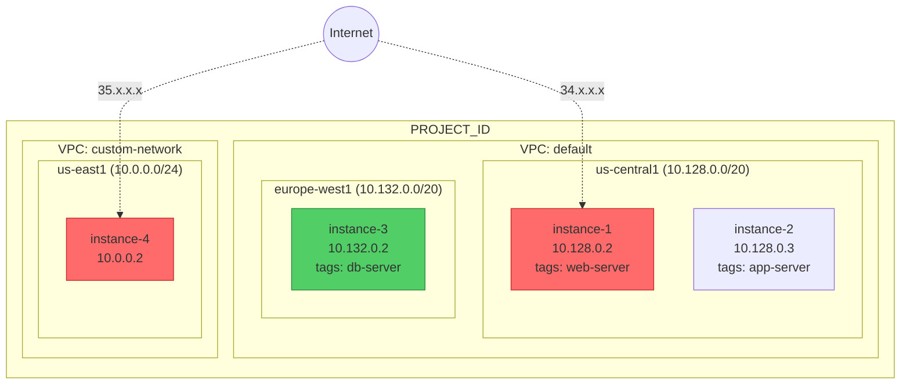
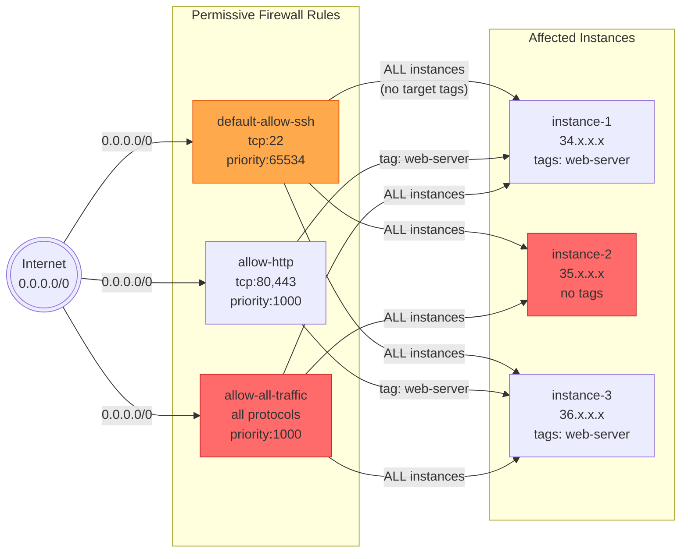
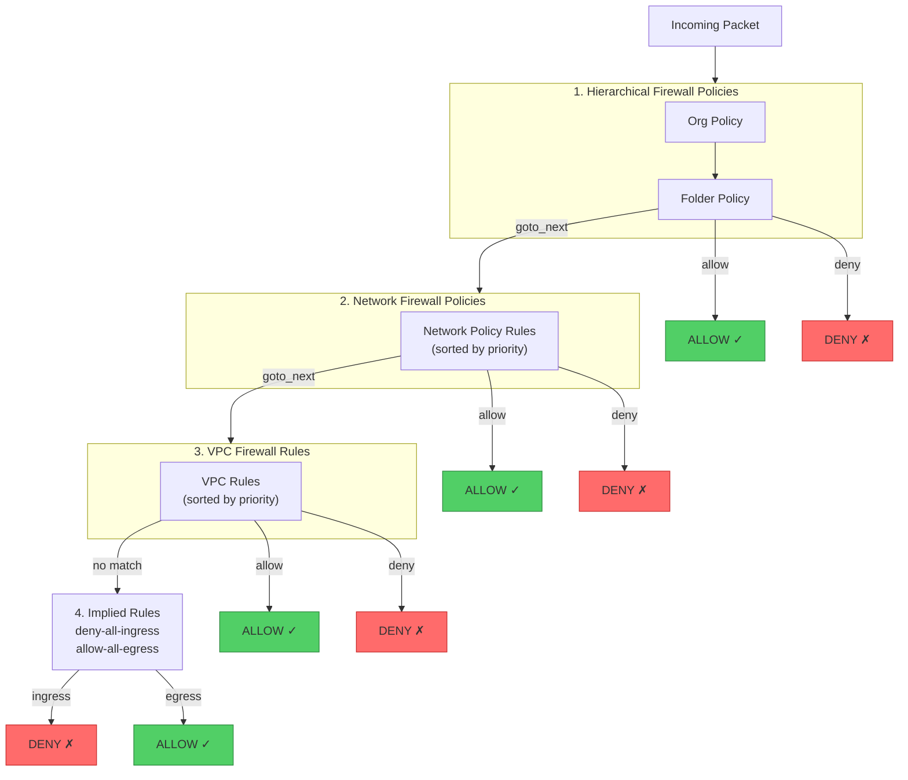

# Firewall Phase 4 -- Effective Firewall & Exposure Analysis

**NIST Function**: IDENTIFY (ID.RA -- Risk Assessment) + DETECT (DE.CM -- Continuous Monitoring)
**Depends on**: `scan-output-firewall/phases/phase-1-state.json`, `phase-2-state.json`, `phase-3-state.json`
**Permissions needed**: `compute.instances.getEffectiveFirewalls`, `compute.instances.list`

---

## Objective

Determine the actual exposure of each Compute Engine instance by examining effective
firewalls (the combined result of hierarchical policies, network policies, and VPC rules).
Identify internet-reachable instances, detect orphaned firewall tags, and generate
Mermaid diagrams for network topology, ingress blast radius, and rule evaluation chains.

**Why effective firewalls matter:**
- Individual VPC rules and policies don't tell the full story -- evaluation order matters
- An instance's actual exposure is the result of ALL applicable rules combined
- Instances with public IPs + permissive ingress rules are directly internet-reachable
- Mermaid diagrams provide visual blast-radius analysis for stakeholder communication

---

## Step 1 -- Effective Firewalls per Instance

For each instance with an external IP (from Phase 1 state), retrieve the combined
effective firewall rules.

```bash
echo "=== Effective Firewalls for Internet-Exposed Instances ==="

# Get instances with external IPs from phase-1 state
gcloud compute instances list --project=$PROJECT_ID --format=json | \
  jq -r '.[] | select(.networkInterfaces[]?.accessConfigs[]?.natIP != null) |
  "\(.name) \(.zone | split("/") | last)"' | \
while IFS=' ' read -r INSTANCE ZONE; do
  echo "=== Instance: $INSTANCE (zone: $ZONE) ==="

  # Get effective firewalls
  gcloud compute instances get-effective-firewalls "$INSTANCE" \
    --zone="$ZONE" \
    --project=$PROJECT_ID \
    --format=json 2>/dev/null | jq .

  echo ""
done
```

For each instance, analyze the effective firewall output:
- List all INGRESS ALLOW rules that apply
- Identify the most permissive rule (widest source range + most ports)
- Check if any DENY rules provide protection
- Determine which policy/VPC level each rule comes from

---

## Step 2 -- Internet-Reachable Instance Analysis

Cross-reference instances with external IPs against permissive ingress rules.

```bash
echo "=== Internet-Reachable Instance Summary ==="

gcloud compute instances list --project=$PROJECT_ID --format=json | \
  jq '[.[] | select(.networkInterfaces[]?.accessConfigs[]?.natIP != null) |
  {name: .name,
   zone: (.zone | split("/") | last),
   externalIP: [.networkInterfaces[].accessConfigs[]?.natIP] | first,
   internalIP: [.networkInterfaces[].networkIP] | first,
   network: [.networkInterfaces[] | .network | split("/") | last] | first,
   tags: (.tags.items // []),
   serviceAccounts: [.serviceAccounts[]?.email],
   status: .status}]'
```

For each instance with an external IP:
1. Check Phase 2 findings: does any FW-VPC-01/02/04/05/10 rule target this instance (via tags or lack of target)?
2. Map: `instance → applicable permissive rules → exposed ports`
3. Determine effective exposure: what ports/protocols can the internet reach?

### Findings

**FW-NET-01** (HIGH): Instance with public IP and permissive 0.0.0.0/0 ingress
- Why: This instance is directly reachable from the internet on one or more ports. Combined with any service vulnerability, this enables remote exploitation.
- Record for each: instance name, zone, external IP, exposed ports, applicable rule names

**FW-NET-02** (MEDIUM): Instance with public IP (informational)
- Why: Public IPs increase attack surface even with restrictive firewall rules. Prefer internal-only instances behind load balancers where possible.
- Not generated if FW-NET-01 already covers the instance.

---

## Step 3 -- Generate Mermaid Diagrams

### 3a -- Network Topology Diagram

Generate `scan-output-firewall/diagrams/network-topology.md`:

```markdown
# Network Topology


```

The agent should populate this template dynamically with:
- Actual VPC networks and subnets from Phase 1 state
- Actual instances grouped by subnet
- Instances with external IPs highlighted in red
- Internal-only instances in green

### 3b -- Ingress Exposure Map (Blast Radius)

Generate `scan-output-firewall/diagrams/ingress-exposure-map.md`:

```markdown
# Ingress Exposure Map


```

The agent should populate this template dynamically with:
- All 0.0.0.0/0 ingress ALLOW rules from Phase 2
- Instances affected by each rule (matched by tags or all instances if no tags)
- Color-coded severity (red = CRITICAL, orange = HIGH)
- Show which instances are hit by multiple permissive rules

### 3c -- Rule Evaluation Chain

Generate `scan-output-firewall/diagrams/rule-evaluation-chain.md`:

```markdown
# Firewall Rule Evaluation Chain


```

The agent should:
- Populate with actual policies/rules found in phases 1-3
- Show which rules matched and their actions
- Highlight where policy-level allows override VPC-level denies (if FW-POL-05 was found)

---

## Step 4 -- Orphaned Firewall Tag Detection

Identify network tags referenced in firewall rules but not present on any instance.

```bash
echo "=== Orphaned Firewall Tags ==="

# Tags in firewall rules (targetTags)
RULE_TAGS=$(gcloud compute firewall-rules list --project=$PROJECT_ID --format=json | \
  jq '[.[].targetTags // [] | .[]] | unique | sort')

# Tags on instances
INSTANCE_TAGS=$(gcloud compute instances list --project=$PROJECT_ID --format=json | \
  jq '[.[].tags.items // [] | .[]] | unique | sort')

echo "Tags in firewall rules: $RULE_TAGS"
echo "Tags on instances: $INSTANCE_TAGS"

# Find tags in rules but not on any instance
echo "--- Orphaned tags (in rules, not on instances) ---"
# The agent should compare these two arrays and report differences
```

### Finding: FW-NET-03

| Field | Value |
|-------|-------|
| Internal ID | FW-NET-03 |
| Title | Orphaned firewall rule tags |
| Severity | LOW |
| NIST | ID.AM |
| Why | Tags referenced in firewall rules but not on any instance indicate stale rules. These create confusion about the security posture and may indicate decommissioned resources whose rules were not cleaned up. |
| Remediation | Review orphaned tags. Delete firewall rules targeting tags that are no longer in use. |

---

## Evaluation Criteria

| Finding | Severity | Internal ID |
|---------|----------|-------------|
| Instance with public IP and permissive 0.0.0.0/0 ingress | HIGH | FW-NET-01 |
| Instance with public IP (informational) | MEDIUM | FW-NET-02 |
| Orphaned firewall rule tags | LOW | FW-NET-03 |

---

## Output

- `scan-output-firewall/phases/phase-4-human.md` -- readable exposure analysis report
- `scan-output-firewall/phases/phase-4-state.json` -- structured findings + diagram metadata
- `scan-output-firewall/docs/03-exposure-analysis.md` -- detailed exposure findings document
- `scan-output-firewall/diagrams/network-topology.md` -- VPC → subnets → instances Mermaid diagram
- `scan-output-firewall/diagrams/ingress-exposure-map.md` -- Internet → rules → instances blast radius
- `scan-output-firewall/diagrams/rule-evaluation-chain.md` -- Policy evaluation order diagram
