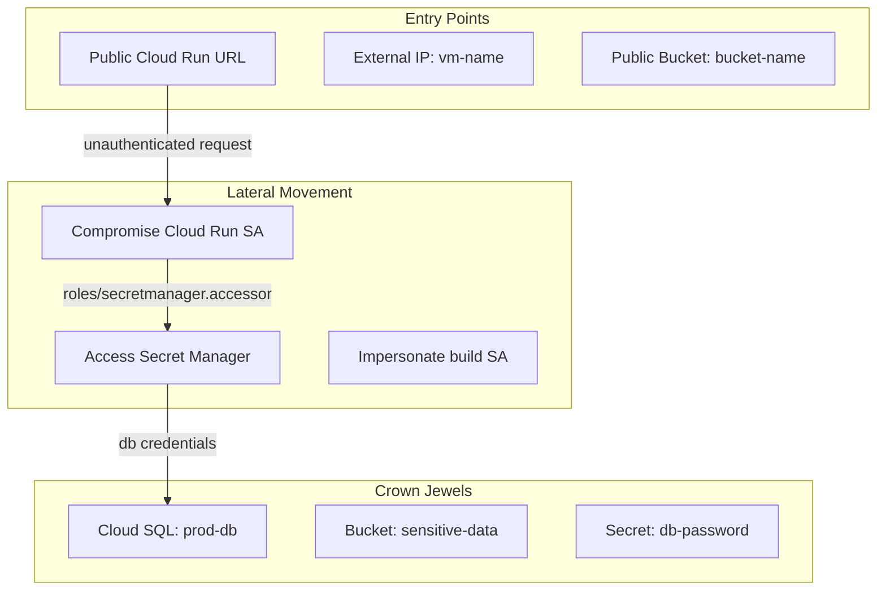

# Phase 0.5 — Threat Model Generation

**NIST Function**: IDENTIFY (ID.RA — Risk Assessment)
**CIS Controls**: N/A (architecture-level)
**Depends on**: Phase 0 state + basic project knowledge

---

## Objective

Before scanning individual controls, model what an attacker would actually target
in this specific architecture. This reprioritizes all downstream findings —
a misconfiguration blocking a non-viable attack path is LOW priority;
the same misconfiguration on a path to your most sensitive data is CRITICAL.

---

## Step 1 — Enumerate Attack Surface

```bash
# All external IP addresses (potential entry points)
gcloud compute instances list \
  --format=json | jq '[.[] | select(.networkInterfaces[].accessConfigs != null) |
  {name, zone, externalIp: .networkInterfaces[].accessConfigs[].natIP}]'

# All Cloud Run services (public URLs)
gcloud run services list --platform=managed --format=json | \
  jq '[.[] | {name, region, url: .status.url,
  ingress: .metadata.annotations["run.googleapis.com/ingress"]}]'

# Public-facing load balancers
gcloud compute forwarding-rules list --format=json | \
  jq '[.[] | select(.loadBalancingScheme == "EXTERNAL")]'

# Public buckets (storage entry/exfil points)
gcloud storage buckets list --format="value(name)" | \
while IFS= read -r bucket; do
  PUBLIC=$(gcloud storage buckets get-iam-policy "gs://$bucket" --format=json 2>/dev/null | \
    jq '.bindings[] | select(.members[] | test("allUsers|allAuthenticatedUsers"))' 2>/dev/null)
  if [ -n "$PUBLIC" ]; then
    echo "PUBLIC BUCKET: $bucket"
    echo "$PUBLIC"
  fi
done

# Cloud Build webhooks (external trigger entry points)
gcloud builds triggers list --format=json | \
  jq '[.[] | select(.webhookConfig != null) | {name, webhookConfig}]'
```

---

## Step 2 — Map Lateral Movement Paths

```bash
# SA-to-resource binding map (who can reach what after initial compromise)
gcloud projects get-iam-policy "$PROJECT_ID" --format=json | \
  jq '.bindings[] | select(.members[] | startswith("serviceAccount:"))'

# Which SAs can impersonate other SAs (iam.serviceAccounts.actAs)
gcloud projects get-iam-policy "$PROJECT_ID" --format=json | \
  jq '.bindings[] | select(.role | test("iam.serviceAccountUser|iam.serviceAccountTokenCreator"))'

# Cloud Run service accounts (compromise Cloud Run = compromise these SAs)
gcloud run services list --platform=managed --format=json | \
  jq '[.[] | {service: .metadata.name,
  serviceAccount: .spec.template.spec.serviceAccountName}]'

# Cloud Build SA (compromise pipeline = compromise build SA)
gcloud projects get-iam-policy "$PROJECT_ID" --format=json | \
  jq '.bindings[] | select(.members[] | contains("cloudbuild.gserviceaccount.com"))'
```

---

## Step 3 — Identify Crown Jewels

```bash
# Buckets with sensitive labels
gcloud storage buckets list --format=json | \
  jq '[.[] | select(.labels.classification != null or
  .labels.data_class != null or .name | test("prod|sensitive|pii|finance|backup"))]'

# Cloud SQL instances (databases = crown jewels)
gcloud sql instances list --format=json 2>/dev/null

# Secret Manager secrets (credentials store)
gcloud secrets list --format=json 2>/dev/null | jq 'length'

# KMS keys (compromise = decrypt everything)
gcloud kms keyrings list --location=global --format=json 2>/dev/null
```

---

## Step 4 — Attacker Persona Analysis

For each persona below, assess feasibility based on discovered resources.
Write "VIABLE" or "NOT VIABLE" with reasoning.

### Persona 1: External Unauthenticated Attacker
- Can they reach any entry point without credentials?
- Entry points: public Cloud Run URLs, external IPs, public buckets, build webhooks

### Persona 2: Compromised Developer Workstation
- Assume attacker has `gcloud auth` as a developer
- What roles does a typical developer have?
- What can they reach from there?
- Can they escalate via `iam.serviceAccounts.actAs`?

### Persona 3: Compromised CI/CD Pipeline
- Assume attacker has Cloud Build SA token
- What roles does Cloud Build SA have? (`roles/editor`? = GAME OVER)
- Can they push malicious images to Artifact Registry?
- Can they deploy to Cloud Run?

### Persona 4: Malicious Insider (Viewer Role)
- What read access reveals sensitive data?
- Can they exfiltrate via public bucket write? Cloud Storage signed URLs?

### Persona 5: Supply Chain Compromise
- Malicious base image or npm package in build
- Which Cloud Run services use external public registry images?
- Is Binary Authorization enforced?

---

## Step 5 — Blast Radius Per SA

For each service account, calculate blast radius score:

```
blast_radius = (number_of_resources_accessible) × (sensitivity_weight_of_resources)

sensitivity weights:
  - roles/editor or roles/owner on project = 100
  - access to Secret Manager secrets = 80
  - access to KMS keys = 80
  - access to Cloud SQL = 70
  - access to sensitive GCS buckets = 60
  - access to Artifact Registry (write) = 50
  - access to Cloud Run (write) = 40
```

---

## Output

Write to:
- `scan-output/phases/phase-0.5-human.md` — threat model narrative
- `scan-output/phases/phase-0.5-state.json` — structured attack paths and personas
- `scan-output/diagrams/attack-paths.md` — Mermaid diagram of viable attack paths
- `scan-output/diagrams/blast-radius-map.md` — Mermaid diagram of SA blast radius
- `scan-output/docs/07-threat-model.md` — full threat model document

### Required Mermaid: Attack Path Diagram


