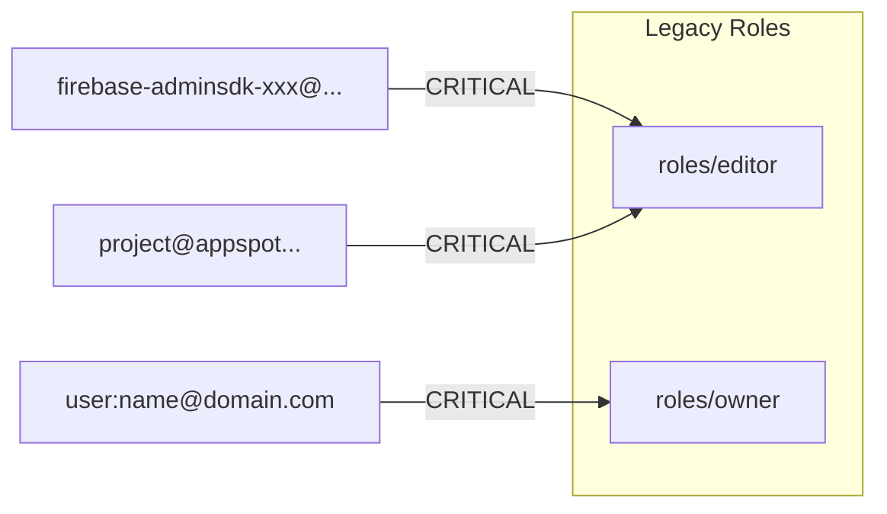

# Phase 2 -- IAM & Legacy Role Audit

**NIST Function**: PROTECT (PR.AC -- Identity Management)
**Depends on**: `scan-output/phases/phase-1-state.json`
**Permissions needed**: `resourcemanager.projects.getIamPolicy`, `iam.serviceAccounts.list`

---

## Objective

This is the core audit phase. Identify all principals (service accounts, users, groups)
with legacy/primitive roles (Editor, Owner) at the project level. Firebase projects are
particularly vulnerable because Firebase auto-grants `roles/editor` to its default
service accounts.

**Why legacy roles are dangerous in Firebase:**
- `roles/editor` bypasses Firebase Security Rules entirely
- Firebase Admin SDK SAs auto-receive `roles/editor` on project creation
- App Engine default SA (`PROJECT_ID@appspot.gserviceaccount.com`) often inherits `roles/editor`
- A compromised SA with `roles/editor` has full read/write to every resource in the project

---

## Step 1 -- Full IAM Policy Extraction

```bash
echo "=== Project IAM Policy ==="
gcloud projects get-iam-policy $PROJECT_ID --format=json
```

---

## Step 2 -- Legacy Role Detection

```bash
echo "=== Legacy Role Bindings ==="

# All principals with roles/editor
echo "--- roles/editor ---"
gcloud projects get-iam-policy $PROJECT_ID --format=json | \
  jq '[.bindings[] | select(.role == "roles/editor") |
  {role: .role, members: .members}]'

# All principals with roles/owner
echo "--- roles/owner ---"
gcloud projects get-iam-policy $PROJECT_ID --format=json | \
  jq '[.bindings[] | select(.role == "roles/owner") |
  {role: .role, members: .members}]'

# All principals with roles/viewer (informational)
echo "--- roles/viewer (informational) ---"
gcloud projects get-iam-policy $PROJECT_ID --format=json | \
  jq '[.bindings[] | select(.role == "roles/viewer") |
  {role: .role, members: .members}]'
```

---

## Step 3 -- Firebase Default SA Legacy Role Check

```bash
echo "=== Firebase Default SA Analysis ==="

IAM_POLICY=$(gcloud projects get-iam-policy $PROJECT_ID --format=json)

# Firebase Admin SDK SA (firebase-adminsdk-*)
echo "--- Firebase Admin SDK SA with roles/editor ---"
echo "$IAM_POLICY" | \
  jq '[.bindings[] | select(.role == "roles/editor") |
  .members[] | select(test("firebase-adminsdk"))]'

# App Engine default SA (PROJECT_ID@appspot.gserviceaccount.com)
echo "--- App Engine default SA with roles/editor ---"
echo "$IAM_POLICY" | \
  jq '[.bindings[] | select(.role == "roles/editor") |
  .members[] | select(test("appspot.gserviceaccount.com"))]'

# Google APIs Service Agent (PROJECT_NUMBER@cloudservices.gserviceaccount.com)
echo "--- Google APIs SA with roles/editor ---"
echo "$IAM_POLICY" | \
  jq '[.bindings[] | select(.role == "roles/editor") |
  .members[] | select(test("cloudservices.gserviceaccount.com"))]'

# Cloud Build default SA
echo "--- Cloud Build SA with roles/editor ---"
echo "$IAM_POLICY" | \
  jq '[.bindings[] | select(.role == "roles/editor") |
  .members[] | select(test("cloudbuild.gserviceaccount.com"))]'

# Cloud Functions SA
echo "--- Cloud Functions SA with roles/editor ---"
echo "$IAM_POLICY" | \
  jq '[.bindings[] | select(.role == "roles/editor") |
  .members[] | select(test("gcf-admin-robot|appspot"))]'
```

---

## Step 4 -- Human User Legacy Role Check

```bash
echo "=== Human User Legacy Roles ==="

# Human users with roles/editor or roles/owner
echo "--- Users with legacy roles ---"
gcloud projects get-iam-policy $PROJECT_ID --format=json | \
  jq '[.bindings[] | select(.role | test("roles/editor|roles/owner")) |
  {role: .role, users: [.members[] | select(startswith("user:"))]}
  | select(.users | length > 0)]'

# Groups with roles/editor or roles/owner
echo "--- Groups with legacy roles ---"
gcloud projects get-iam-policy $PROJECT_ID --format=json | \
  jq '[.bindings[] | select(.role | test("roles/editor|roles/owner")) |
  {role: .role, groups: [.members[] | select(startswith("group:"))]}
  | select(.groups | length > 0)]'
```

---

## Step 5 -- SA Key Analysis

```bash
echo "=== SA Key Analysis ==="

# Check each SA for user-managed keys
gcloud iam service-accounts list --project=$PROJECT_ID --format="value(email)" | \
while IFS= read -r SA; do
  KEYS=$(gcloud iam service-accounts keys list \
    --iam-account="$SA" \
    --managed-by=user \
    --format=json 2>/dev/null)
  if [ "$KEYS" != "[]" ] && [ -n "$KEYS" ]; then
    echo "SA with user-managed keys: $SA"
    echo "$KEYS" | jq '[.[] | {keyId: .name, created: .validAfterTime, expires: .validBeforeTime}]'
  fi
done
```

For each key found, calculate:
- `key_age_days` = today - key creation date
- Flag if key_age_days > 90 (HIGH - FB-IAM-08)
- Flag if key_age_days > 365 (CRITICAL - FB-IAM-09)

---

## Step 6 -- Cross-Project & External Access

```bash
echo "=== Cross-Project & External Access ==="

# SAs from other projects with bindings here
echo "--- Cross-project SAs ---"
gcloud projects get-iam-policy $PROJECT_ID --format=json | \
  jq '[.bindings[].members[] | select(startswith("serviceAccount:") and
  (contains("'$PROJECT_ID'") | not) and
  (contains("gcp-sa-") | not) and
  (contains("cloudservices") | not))]'

# External user accounts (non-corporate domains)
echo "--- External users ---"
gcloud projects get-iam-policy $PROJECT_ID --format=json | \
  jq '[.bindings[] | select(.members[] | test("gmail.com|yahoo.com|hotmail.com|outlook.com"))]'
```

---

## Step 7 -- Org-Level Check (if ORG_ID is set)

```bash
if [ -n "$ORG_ID" ]; then
  echo "=== Org-Level Legacy Role Bindings ==="
  gcloud organizations get-iam-policy $ORG_ID --format=json 2>/dev/null | \
    jq '[.bindings[] | select(.role | test("roles/owner|roles/editor"))]' 2>/dev/null
fi
```

---

## Evaluation Criteria

| Finding | Severity | Internal ID |
|---------|----------|-------------|
| Firebase Admin SDK SA has roles/editor | CRITICAL | FB-IAM-01 |
| App Engine default SA has roles/editor | CRITICAL | FB-IAM-02 |
| Cloud Build default SA has roles/editor | CRITICAL | FB-IAM-03 |
| Human user has roles/editor at project level | CRITICAL | FB-IAM-04 |
| Human user has roles/owner at project level | CRITICAL | FB-IAM-05 |
| Group has roles/editor or roles/owner | CRITICAL | FB-IAM-06 |
| Any SA has user-managed keys | HIGH | FB-IAM-07 |
| SA user-managed key age > 90 days | HIGH | FB-IAM-08 |
| SA user-managed key age > 365 days | CRITICAL | FB-IAM-09 |
| Cross-project SA with editor/owner | HIGH | FB-IAM-10 |
| External user (gmail etc) with any role | HIGH | FB-IAM-11 |
| Cloud Functions SA has roles/editor | CRITICAL | FB-IAM-12 |
| Google APIs SA has roles/editor (expected but document) | LOW | FB-IAM-13 |

**Note on FB-IAM-01:** Firebase auto-grants `roles/editor` to the Admin SDK SA on project creation.
While this is "expected" by Firebase, it is a security anti-pattern. The remediation is to
replace it with `roles/firebase.sdkAdminServiceAgent` or more granular roles.

---

## Output

- `scan-output/phases/phase-2-human.md` -- readable IAM audit report
- `scan-output/phases/phase-2-state.json` -- structured findings
- `scan-output/docs/01-iam-legacy-roles.md` -- detailed IAM findings document
- `scan-output/diagrams/sa-role-map.md` -- Mermaid diagram of SA-to-role bindings
- `scan-output/diagrams/legacy-role-blast-radius.md` -- blast radius of principals with Editor/Owner

### SA Role Map Diagram Format


