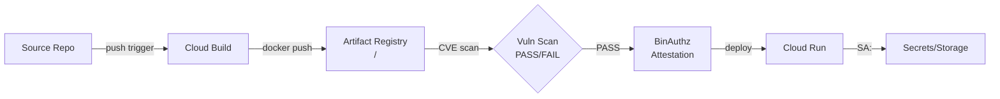

# Phase 4a — Infrastructure Scan

**NIST Function**: IDENTIFY + PROTECT
**CIS Controls**: Section 4 (VM), Section 3 (Logging), Section 2 (Networking)
**Depends on**: Phase 3 status READY or PARTIAL

---

## Compute Instances

```bash
# Full instance inventory
gcloud compute instances list --format=json

# Per instance: detailed config
for INSTANCE in $(gcloud compute instances list --format="value(name,zone)"); do
  NAME=$(echo $INSTANCE | cut -d' ' -f1)
  ZONE=$(echo $INSTANCE | cut -d' ' -f2)
  gcloud compute instances describe $NAME --zone=$ZONE --format=json
done

# Shielded VM status
gcloud compute instances list --format=json | \
  jq '[.[] | {name, shieldedInstanceConfig, shieldedInstanceIntegrityPolicy}]'

# Project-wide SSH keys (should be blocked per instance)
gcloud compute project-info describe --format=json | jq '.commonInstanceMetadata'

# OS Login status
gcloud compute project-info describe --format=json | \
  jq '.commonInstanceMetadata.items[] | select(.key == "enable-oslogin")'
```

**Flag as CRITICAL:**
- Instance with external IP + firewall rule allowing 0.0.0.0/0 on port 22 or 3389
- Project-wide SSH keys not blocked

**Flag as HIGH:**
- Shielded VM not enabled on prod instances
- OS Login not enforced

---

## Disks

```bash
gcloud compute disks list --format=json
# Check encryption: GOOGLE_MANAGED vs CUSTOMER_MANAGED vs CUSTOMER_SUPPLIED
gcloud compute disks list --format=json | \
  jq '[.[] | {name, sizeGb, type, status, diskEncryptionKey, users}]'
```

---

## VPCs, Subnets & Firewall Rules

```bash
# Networks
gcloud compute networks list --format=json

# Subnets — check Private Google Access and Flow Logs
gcloud compute networks subnets list --format=json | \
  jq '[.[] | {name, region, ipCidrRange, privateIpGoogleAccess,
  enableFlowLogs, logConfig}]'

# Firewall rules — full detail
gcloud compute firewall-rules list --format=json

# Rules allowing from 0.0.0.0/0 (internet-open)
gcloud compute firewall-rules list --format=json | \
  jq '[.[] | select(.sourceRanges[] == "0.0.0.0/0" or .sourceRanges[] == "::/0")]'

# Firewall Insights recommendations
gcloud recommender recommendations list \
  --recommender=google.compute.firewall.Recommender \
  --project=$PROJECT_ID \
  --location=global \
  --format=json

# Routes
gcloud compute routes list --format=json

# Cloud NAT
gcloud compute routers list --format=json
for ROUTER in $(gcloud compute routers list --format="value(name,region)"); do
  NAME=$(echo $ROUTER | cut -d' ' -f1)
  REGION=$(echo $ROUTER | cut -d' ' -f2)
  gcloud compute routers get-nat-mapping-info $NAME --region=$REGION --format=json 2>/dev/null
done
```

**Flag as CRITICAL:**
- Firewall rule: direction=INGRESS, source=0.0.0.0/0, port=22 (SSH)
- Firewall rule: direction=INGRESS, source=0.0.0.0/0, port=3389 (RDP)
- Default VPC network still exists

**Flag as HIGH:**
- Firewall rule: direction=INGRESS, source=0.0.0.0/0, port=any (allow all)
- Subnet with no VPC Flow Logs in prod
- Firewall Insights flags rule as "overly permissive" or "0 hits in 90 days"

---

## Cloud Armor & Load Balancers

```bash
# External load balancers
gcloud compute forwarding-rules list --format=json | \
  jq '[.[] | select(.loadBalancingScheme == "EXTERNAL")]'

# Cloud Armor security policies
gcloud compute security-policies list --format=json
gcloud compute security-policies describe POLICY_NAME --format=json

# IAP-protected resources
gcloud iap settings get --project=$PROJECT_ID --format=json 2>/dev/null
```

---

## Diagrams to Generate

**network-topology.md:**
```mermaid
graph TD
  subgraph VPC: <name>
    SN1[Subnet: <name>\n<cidr>\nFlow Logs: ON/OFF]
    SN2[Subnet: <name>\n<cidr>]
  end
  VM1[<instance>\n<external-ip> / <internal-ip>] --> SN1
  INTERNET -->|fw: allow-ssh\n0.0.0.0/0:22 ⚠️| VM1
  SN1 -->|NAT Gateway| INTERNET
```

---

## Output

- `scan-output/phases/phase-4a-human.md`
- `scan-output/phases/phase-4a-state.json`
- `scan-output/docs/01-compute-network.md`
- `scan-output/diagrams/network-topology.md`

---
---

# Phase 4b — Identity & Access Scan

**NIST Function**: PROTECT (PR.AC — Identity Management)
**CIS Controls**: Section 1 (IAM)
**Depends on**: Phase 3 READY or PARTIAL

---

## Service Account Full Inventory

```bash
# All service accounts
gcloud iam service-accounts list --format=json

# Per SA: keys and metadata
for SA in $(gcloud iam service-accounts list --format="value(email)"); do
  echo "=== SA: $SA ==="
  gcloud iam service-accounts describe $SA --format=json
  gcloud iam service-accounts keys list --iam-account=$SA --format=json
done

# Project-level IAM bindings
gcloud projects get-iam-policy $PROJECT_ID --format=json

# Primitive role bindings (owner, editor — flag immediately)
gcloud projects get-iam-policy $PROJECT_ID --format=json | \
  jq '[.bindings[] | select(.role | test("roles/owner|roles/editor"))]'

# External members (non-corp domain)
gcloud projects get-iam-policy $PROJECT_ID --format=json | \
  jq '[.bindings[] | select(.members[] | test("gmail.com|yahoo.com|hotmail.com"))]'

# allUsers / allAuthenticatedUsers bindings
gcloud projects get-iam-policy $PROJECT_ID --format=json | \
  jq '[.bindings[] | select(.members[] | test("allUsers|allAuthenticatedUsers"))]'

# Cross-project SA access (SAs from other projects with bindings here)
gcloud projects get-iam-policy $PROJECT_ID --format=json | \
  jq '[.bindings[].members[] | select(startswith("serviceAccount:") and
  (contains("'$PROJECT_ID'") | not))]'

# SA impersonation bindings
gcloud projects get-iam-policy $PROJECT_ID --format=json | \
  jq '[.bindings[] | select(.role | test("iam.serviceAccountUser|iam.serviceAccountTokenCreator"))]'
```

---

## SA Last-Used via Audit Logs

```bash
# Last authentication per SA (batch — all project SAs, last 90 days)
gcloud logging read \
  'protoPayload.authenticationInfo.principalEmail=~"@'$PROJECT_ID'.iam.gserviceaccount.com"
   AND protoPayload.@type="type.googleapis.com/google.cloud.audit.AuditLog"
   AND severity!="DEBUG"' \
  --project=$PROJECT_ID \
  --limit=500 \
  --format=json \
  --freshness=90d | \
  jq 'group_by(.protoPayload.authenticationInfo.principalEmail) |
      map({sa: .[0].protoPayload.authenticationInfo.principalEmail,
           last_seen: (map(.timestamp) | max),
           event_count: length})'
```

---

## SA Key Age Analysis

For each SA key found, calculate:
- `key_age_days` = today - key creation date
- Flag if key_age_days > 90 (HIGH)
- Flag if key_age_days > 365 (CRITICAL)
- Flag if key type is USER_MANAGED (SYSTEM_MANAGED keys auto-rotate)

---

## IAM Recommender

```bash
gcloud recommender recommendations list \
  --recommender=google.iam.policy.Recommender \
  --project=$PROJECT_ID \
  --location=global \
  --format=json | \
  jq '[.[] | {name, description, stateInfo, primaryImpact, content}]'
```

---

## Workload Identity Federation Status

```bash
# Check if WIF pools exist (preferred over SA keys for external workloads)
gcloud iam workload-identity-pools list \
  --location=global \
  --project=$PROJECT_ID \
  --format=json 2>/dev/null

# GitHub Actions → GCP (keyless auth configured?)
gcloud iam workload-identity-pools providers list \
  --workload-identity-pool=POOL_ID \
  --location=global \
  --project=$PROJECT_ID \
  --format=json 2>/dev/null
```

**Flag as CRITICAL:**
- `roles/editor` or `roles/owner` bound to any SA or user
- `allUsers` or `allAuthenticatedUsers` in any project binding
- External user (gmail.com) with any role
- SA key age > 365 days

**Flag as HIGH:**
- SA unused for 90+ days but has active user-managed keys
- Cloud Build default SA has `roles/editor` (extremely common and critical)
- SA key age > 90 days
- No Workload Identity Federation when GitHub Actions / external CI is used
- IAM Recommender flags unused permissions

---

## Output

- `scan-output/phases/phase-4b-human.md`
- `scan-output/phases/phase-4b-state.json`
- `scan-output/docs/06-service-accounts.md`
- `scan-output/audit/sa-last-used-report.md`
- `scan-output/audit/sa-key-age-report.md`
- `scan-output/audit/orphaned-sa-report.md`
- `scan-output/audit/sa-key-elimination-roadmap.md`
- `scan-output/diagrams/service-account-map.md`
- `scan-output/diagrams/sa-risk-matrix.md`

---
---

# Phase 4c — Data & Secrets Scan

**NIST Function**: PROTECT (PR.DS — Data Security)
**CIS Controls**: Section 5 (Storage), Section 6 (BigQuery)
**Depends on**: Phase 3 READY or PARTIAL

---

## Cloud Storage

```bash
# All buckets
gcloud storage buckets list --format=json

# Per bucket: full security config
for BUCKET in $(gcloud storage buckets list --format="value(name)"); do
  echo "=== Bucket: $BUCKET ==="
  gcloud storage buckets describe gs://$BUCKET --format=json
  gcloud storage buckets get-iam-policy gs://$BUCKET --format=json
done

# Public access prevention status
gcloud storage buckets list --format=json | \
  jq '[.[] | {name, publicAccessPrevention: .iamConfiguration.publicAccessPrevention,
  uniformBucketLevelAccess: .iamConfiguration.uniformBucketLevelAccess.enabled,
  versioning: .versioning.enabled,
  encryption: .encryption,
  retentionPolicy: .retentionPolicy}]'
```

**Flag as CRITICAL:**
- Bucket with `allUsers` or `allAuthenticatedUsers` IAM binding
- Bucket with public access prevention = `inherited` (not enforced) + public binding

**Flag as HIGH:**
- `uniformBucketLevelAccess` = false (using legacy ACLs)
- No versioning on buckets containing critical data
- No CMEK on buckets labeled as confidential/restricted

---

## Secret Manager

```bash
# Secrets inventory (metadata only — never access values)
gcloud secrets list --format=json

# Per secret: access policy and rotation
for SECRET in $(gcloud secrets list --format="value(name)"); do
  echo "=== Secret: $SECRET ==="
  gcloud secrets describe $SECRET --format=json
  gcloud secrets get-iam-policy $SECRET --format=json
done

# Secrets without rotation configured
gcloud secrets list --format=json | \
  jq '[.[] | select(.rotation == null) | {name, createTime, replication}]'
```

---

## Cloud KMS

```bash
# Key rings
gcloud kms keyrings list --location=global --format=json
for LOCATION in $(gcloud kms locations list --format="value(locationId)"); do
  gcloud kms keyrings list --location=$LOCATION --format=json 2>/dev/null
done

# Keys per keyring
gcloud kms keys list --keyring=KEYRING --location=LOCATION --format=json

# Key rotation period (should be <= 365 days)
gcloud kms keys list --keyring=KEYRING --location=LOCATION --format=json | \
  jq '[.[] | {name, purpose, rotationPeriod, nextRotationTime,
  primaryState: .primary.state}]'
```

**Flag as HIGH:**
- KMS key rotation period > 365 days or no rotation configured
- KMS Admin and KMS CryptoKey Encrypter/Decrypter roles on same principal (SoD violation)

---

## Cloud SQL

```bash
# SQL instances
gcloud sql instances list --format=json

# Per instance: security config
for INSTANCE in $(gcloud sql instances list --format="value(name)"); do
  gcloud sql instances describe $INSTANCE --format=json | \
    jq '{name, databaseVersion, settings: {
      ipConfiguration: .settings.ipConfiguration,
      backupConfiguration: .settings.backupConfiguration,
      databaseFlags: .settings.databaseFlags,
      maintenanceWindow: .settings.maintenanceWindow}}'
done
```

**Flag as CRITICAL:**
- SQL instance with public IP + authorized network `0.0.0.0/0`
- SSL not required on SQL instance

**Flag as HIGH:**
- Automated backups not enabled
- No point-in-time recovery
- SQL instance with public IP (even with restricted authorized networks)

---

## Data Classification Check

```bash
# Check bucket labels for classification tags
gcloud storage buckets list --format=json | \
  jq '[.[] | {name, labels}]'

# Check project labels
gcloud projects describe $PROJECT_ID --format=json | jq '.labels'
```

---

## Output

- `scan-output/phases/phase-4c-human.md`
- `scan-output/phases/phase-4c-state.json`
- `scan-output/docs/02-storage.md`
- `scan-output/audit/data-classification.md`
- `scan-output/audit/data-exposure-findings.md`
- `scan-output/audit/backup-dr-readiness.md`

---
---

# Phase 4d — Containers & Supply Chain Scan

**NIST Function**: PROTECT (PR.IP — Information Protection)
**CIS Controls**: Section 7 (Container Registry)
**Depends on**: Phase 3 READY or PARTIAL

---

## Cloud Run

```bash
# All services
gcloud run services list --platform=managed --format=json

# Per service: full config
for SERVICE in $(gcloud run services list --platform=managed --format="value(metadata.name,metadata.namespace)"); do
  NAME=$(echo $SERVICE | cut -d' ' -f1)
  REGION=$(echo $SERVICE | cut -d' ' -f2)
  gcloud run services describe $NAME \
    --platform=managed \
    --region=$REGION \
    --format=json
done

# Services with public ingress (all traffic = internet-facing)
gcloud run services list --platform=managed --format=json | \
  jq '[.[] | select(.metadata.annotations["run.googleapis.com/ingress"] == "all") |
  {name, region, url: .status.url, ingress: .metadata.annotations["run.googleapis.com/ingress"],
  serviceAccount: .spec.template.spec.serviceAccountName}]'

# VPC connector usage (private connectivity)
gcloud run services list --platform=managed --format=json | \
  jq '[.[] | select(.spec.template.metadata.annotations["run.googleapis.com/vpc-access-connector"] != null)]'
```

---

## Artifact Registry

```bash
# Repositories
gcloud artifacts repositories list --format=json

# Images per Docker repo (with vulnerability data)
for REPO in $(gcloud artifacts repositories list \
  --filter="format=DOCKER" \
  --format="value(name)"); do
  echo "=== Repo: $REPO ==="
  gcloud artifacts docker images list $REPO \
    --show-occurrences \
    --format=json 2>/dev/null | head -50
done

# Critical/High CVEs in currently deployed images
# Cross-reference: Cloud Run image tags vs AR vulnerability findings
```

---

## Cloud Build

```bash
# Triggers
gcloud builds triggers list --format=json

# Recent builds (last 20)
gcloud builds list --limit=20 --format=json

# Cloud Build SA roles (CRITICAL CHECK)
gcloud projects get-iam-policy $PROJECT_ID --format=json | \
  jq '[.bindings[] | select(.members[] | contains("cloudbuild.gserviceaccount.com"))]'

# Approval gates on triggers
gcloud builds triggers list --format=json | \
  jq '[.[] | {name, approvalConfig, serviceAccount}]'

# Substitution variables (may reveal config patterns — not values)
gcloud builds triggers list --format=json | \
  jq '[.[] | {name, substitutions: (.substitutions // {})}]'
```

**Flag as CRITICAL:**
- Cloud Build default SA (`@cloudbuild.gserviceaccount.com`) has `roles/editor`
- No approval gate on triggers that deploy to production

---

## Binary Authorization

```bash
# Policy
gcloud container binauthz policy export --format=json 2>/dev/null

# Is policy in ENFORCE mode or DRY_RUN?
# Are attestors configured?
gcloud container binauthz attestors list --format=json 2>/dev/null
```

**Flag as HIGH:**
- BinAuthz not enabled or in DRY_RUN only mode for prod deployments
- No attestation required for Cloud Run deployments

---

## Diagrams to Generate

**cicd-pipeline.md:**


---

## Output

- `scan-output/phases/phase-4d-human.md`
- `scan-output/phases/phase-4d-state.json`
- `scan-output/docs/03-cloud-run.md`
- `scan-output/docs/04-artifact-registry.md`
- `scan-output/docs/05-cloud-build.md`
- `scan-output/diagrams/cicd-pipeline.md`

---
---

# Phase 4e — Runtime Signals Scan

**NIST Function**: DETECT (DE.CM — Monitoring)
**CIS Controls**: Section 2 (Logging)
**Depends on**: Phase 3 READY or PARTIAL

---

## Security Command Center

```bash
# Active threat findings (not misconfigs — actual threats)
gcloud scc findings list projects/$PROJECT_ID \
  --filter="state=\"ACTIVE\" AND category=\"THREAT\"" \
  --format=json 2>/dev/null

# All active HIGH/CRITICAL findings
gcloud scc findings list projects/$PROJECT_ID \
  --filter="state=\"ACTIVE\" AND severity=\"CRITICAL\" OR severity=\"HIGH\"" \
  --format=json 2>/dev/null

# Mute rules — check for rules hiding findings (potential audit evasion)
gcloud scc muteconfigs list \
  --parent=projects/$PROJECT_ID \
  --format=json 2>/dev/null

# SCC sources enabled
gcloud scc sources list \
  --organization=$ORG_ID \
  --format=json 2>/dev/null
```

**Flag as CRITICAL:**
- Any active THREAT-category SCC finding
- Mute rules that suppress CRITICAL/HIGH findings without documented justification

---

## Cost Anomaly Signals

```bash
# Budget alerts configured?
gcloud billing budgets list \
  --billing-account=$BILLING_ACCOUNT_ID \
  --format=json 2>/dev/null

# Recent billing data (look for spikes)
# Note: detailed cost data requires billing export to BigQuery
```

**Flag as MEDIUM:**
- No budget alerts configured (cannot detect cryptomining/exfil via cost spike)

---

## Unusual Activity in Audit Logs

```bash
# SA key creation events (last 30 days)
gcloud logging read \
  'protoPayload.methodName="google.iam.admin.v1.CreateServiceAccountKey"' \
  --project=$PROJECT_ID \
  --freshness=30d \
  --format=json | \
  jq '[.[] | {timestamp, who: .protoPayload.authenticationInfo.principalEmail,
  what: .protoPayload.request.serviceAccount}]'

# IAM policy change events
gcloud logging read \
  'protoPayload.methodName="SetIamPolicy"' \
  --project=$PROJECT_ID \
  --freshness=30d \
  --format=json | \
  jq '[.[] | {timestamp, who: .protoPayload.authenticationInfo.principalEmail,
  resource: .resource}]' | head -50

# Public bucket creation events
gcloud logging read \
  'protoPayload.methodName="storage.setIamPermissions"
   AND protoPayload.serviceData.policyDelta.bindingDeltas.member="allUsers"' \
  --project=$PROJECT_ID \
  --freshness=30d \
  --format=json 2>/dev/null

# Firewall rule changes
gcloud logging read \
  'protoPayload.methodName=~"compute.firewalls"' \
  --project=$PROJECT_ID \
  --freshness=30d \
  --format=json | head -20
```

---

## Output

- `scan-output/phases/phase-4e-human.md`
- `scan-output/phases/phase-4e-state.json`
- `scan-output/audit/cost-anomaly-signals.md`

---
---

# Phase 4f — Detection & Response Readiness Scan

**NIST Function**: DETECT + RESPOND + RECOVER
**CIS Controls**: Section 2 (Logging), Section 3 (Monitoring)
**Depends on**: Phase 3 READY or PARTIAL

---

## Log Sinks (Export)

```bash
# Project-level sinks
gcloud logging sinks list --project=$PROJECT_ID --format=json

# Are logs exported to SIEM / long-term storage?
# Check for: bigquery, pubsub, storage destination types
gcloud logging sinks list --project=$PROJECT_ID --format=json | \
  jq '[.[] | {name, destination, filter, disabled}]'

# Org-level sinks
gcloud logging sinks list --organization=$ORG_ID --format=json 2>/dev/null
```

**Flag as HIGH:**
- No log sinks configured (logs lost after 30 days, no SIEM)
- Log sink is disabled

---

## Alerting Policies

```bash
# Monitoring alert policies
gcloud alpha monitoring policies list --project=$PROJECT_ID --format=json 2>/dev/null

# Check for security-critical alert types:
REQUIRED_ALERTS=(
  "IAM policy changes"
  "Service account key creation"
  "Firewall rule changes"
  "Public bucket creation"
  "SCC high severity findings"
  "Billing anomaly"
)
```

**Flag as HIGH for each missing critical alert type.**

---

## Data Access Audit Logging

```bash
# Check which services have Data Access audit logs enabled
gcloud projects get-iam-policy $PROJECT_ID --format=json | \
  jq '.auditConfigs'
```

**Flag as MEDIUM:**
- Data Access audit logs not enabled for Cloud Storage, Secret Manager, KMS, BigQuery

---

## Backup & DR Configuration

```bash
# Cloud SQL backups
gcloud sql instances list --format=json | \
  jq '[.[] | {name, settings: {
    backupConfiguration: .settings.backupConfiguration,
    availabilityType: .settings.availabilityType}}]'

# GCS versioning
gcloud storage buckets list --format=json | \
  jq '[.[] | {name, versioning: .versioning.enabled}]'
```

---

## Runbook Gap Check

After scanning alerting policies, cross-reference:
For each alert type that EXISTS, check if a corresponding runbook exists in `scan-output/ir/playbooks/`.
Output a matrix:

| Alert Type | Policy Exists | Runbook Exists | Gap |
|-----------|--------------|----------------|-----|
| IAM policy change | ✅ | ❌ | YES |
| SA key creation | ❌ | ❌ | YES |

---

## Output

- `scan-output/phases/phase-4f-human.md`
- `scan-output/phases/phase-4f-state.json`
- `scan-output/ir/plan.md` (skeleton IR plan based on findings)
- `scan-output/ir/playbooks/iam-escalation.md`
- `scan-output/ir/playbooks/public-exposure.md`
- `scan-output/ir/playbooks/credential-compromise.md`
